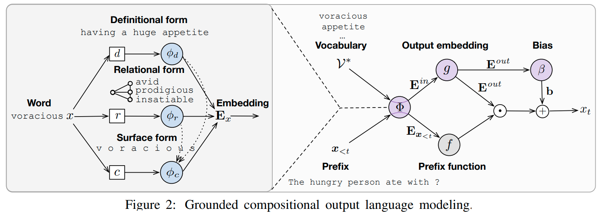

<b>GroC</b> —
a Pytorch implementation of GroC, a grounded compositional output model for adaptive language modeling presented at EMNLP 2020 [<a href="https://www.aclweb.org/anthology/2020.emnlp-main.96.pdf">1</a>]. The model has a fully compositional output embedding layer that is optionally further grounded in information from a structured lexicon (WordNet), namely semantically related words and free-text definitions. It can be applied to both conventional language modeling as well as challenging cross-domain settings with an open vocabulary. 

<p align="center">
<a href="https://arxiv.org/pdf/1905.05513.pdf"></a>
</p>

```
@inproceedings{pappas-etal-2020-grounded,
    title = "Grounded Compositional Outputs for Adaptive Language Modeling",
    author = "Pappas, Nikolaos and Mulcaire, Phoebe and Smith, Noah A.",
    booktitle = "Proceedings of the 2020 Conference on Empirical Methods in Natural Language Processing (EMNLP)",
    publisher = "Association for Computational Linguistics",
    url = "https://www.aclweb.org/anthology/2020.emnlp-main.96",
    pages = "1252--1267",
    year = "2020"
}
```

# Installation
Note that this repository is based on the codebase of <a href="https://github.com/salesforce/awd-lstm-lm">awd-lstm</a>, for a general purpose language model consider using that library directly [<a href="https://arxiv.org/pdf/1708.02182.pdf">2</a>]. Before running the code make sure you have installed the conda environment first:
```bash
conda env create -f environment.yml
```

# Data 
To obtain the datasets for conventional language modeling please follow the instructions from [<a href="https://arxiv.org/pdf/1708.02182.pdf">2</a>], e.g. the datasets can be easily obtained by running <a href="https://github.com/salesforce/awd-lstm-lm/blob/master/getdata.sh">this</a> script.

Example:
```bash
echo "- Downloading Penn Treebank (PTB)"
wget --quiet --continue http://www.fit.vutbr.cz/~imikolov/rnnlm/simple-examples.tgz
tar -xzf simple-examples.tgz``
mkdir -p penn
cd penn
mv ../simple-examples/data/ptb.train.txt train.txt
mv ../simple-examples/data/ptb.test.txt test.txt
mv ../simple-examples/data/ptb.valid.txt valid.txt
cd ..
rm -rf simple-examples/
```

# Training
Below you can find a few example training commands for training the baseline language model or GroC with different options.  

Baseline (tied)
```bash
python -W ignore  main.py --data penn --dropouti 0.4 --dropouth 0.25 --seed 28 --batch_size 20 --epoch 1000\
 --save tied --cuda --cuda_device 0

```
GroC (char, rel, def)
```bash
python -W ignore  main.py --data penn --dropouti 0.4 --dropouth 0.25 --seed 28 --batch_size 20 --epoch 1000\
--save groc_char --char_emb --char_update_ratio 0.3 --cuda --cuda_device 0
```

GroC for adaptation (char, rel, def, deep residual net, bias estimator)
```bash
python -W ignore  main.py --data penn --dropouti 0.4 --dropouth 0.25 --seed 28 --batch_size 20 \
--epoch 1000 --save groc_full --char_emb --predict_bias --joint_emb 400 --joint_emb_depth 4 --joint_dropout 0.6\ 
--joint_locked_dropout --joint_emb_activation Sigmoid --char_update_ratio 0.3 --cuda --cuda_device 0

```

# Evaluation 

Download the News Crawl data here (http://statmt.org/wmt14/translation-task.html, under “Monolingual language model training data”). Place the downloaded files in a directory called “raw” and run scripts/create-data.sh to recreate our splits.

```bash
python evaluate.py --test_data data/news2007_train.news2008_test/ --save saved-models/[our model] --cuda  
--cuda_device 0 --seed 1234 --adapt_method [change_vocab|interpolate_neural|interpolate_unigram]
```

References
------------
* [1] Nikolaos Pappas, Phoebe Mulcaire, Noah A. Smith <a href="https://www.aclweb.org/anthology/2020.emnlp-main.96.pdf">Grounded Compositional Outputs for Adaptive Language Modeling</a>, Conference on Empirical Methods in Natural Language Processing, 2020
* [2]  Stephen Merity, Nitish Shirish Keskar, Richard Socher, <a href="https://arxiv.org/pdf/1708.02182.pdf">Regularizing and Optimizing LSTM Language Models</a>, Sixth International Conference on Learning Representations, Vancouver, Canada, 2018


Contact
------------
For questions and requests please email: npappas@cs.washington.edu, pmulcaire@cs.washington.edu.

